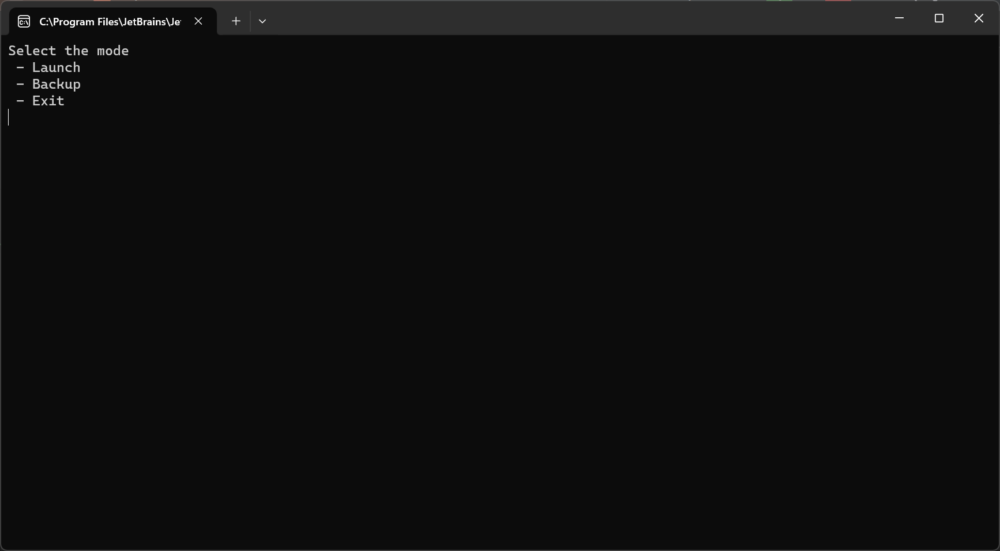
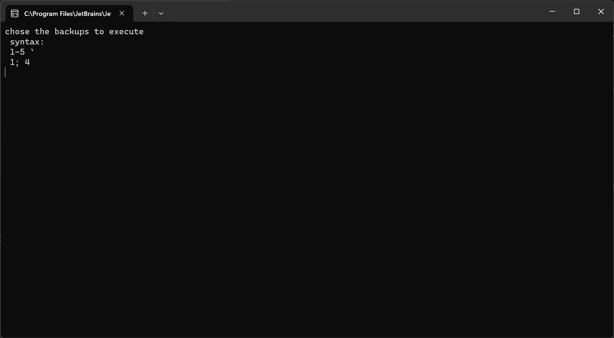

# User Manual

---

## Table of Contents
1. [Introduction](#introduction)
2. [Installation](#installation)
3. [Mode](#mode)
   1. [Setup Backup](#backup)
   2. [Launch Backup](#launch)

---

## Introduction <a name="introduction"></a>

EasySave is a backup software that allows you to save your files in a secure way. It is a command line interface (CLI) software that can be used in two different modes: Backup and Restore. The software is developed in C# and is compatible with Windows 10.


## Installation <a name="installation"></a>

To install EasySave, you need to download the latest release of the software. You can find it in the
[Releases]() section of the GitHub repository.

## Mode <a name="mode"></a>

When you launch the software, a screen will appear and ask you to choose a mode.

The software can be used in two different modes: Backup and Launch



### Setup Backup <a name="backup"></a>

To setup a backup, you need to launch the software with the following command:
```Backup ```

You'll see this screen:

You'll have to select the bachup you want to setup. You'll be ask to enter the source path and the destination file path

### Launch Backup <a name="launch"></a>

Once you choose this mode, this screen will appear:



You can launch one or several backups with the following commands:

- ``` 5 ``` : Launch the backup 5
- ``` 1;2;3 ``` : Launch the backups 1, 2 and 3
- ``` 1-4 ``` : Launch the backups from 1 to 4
